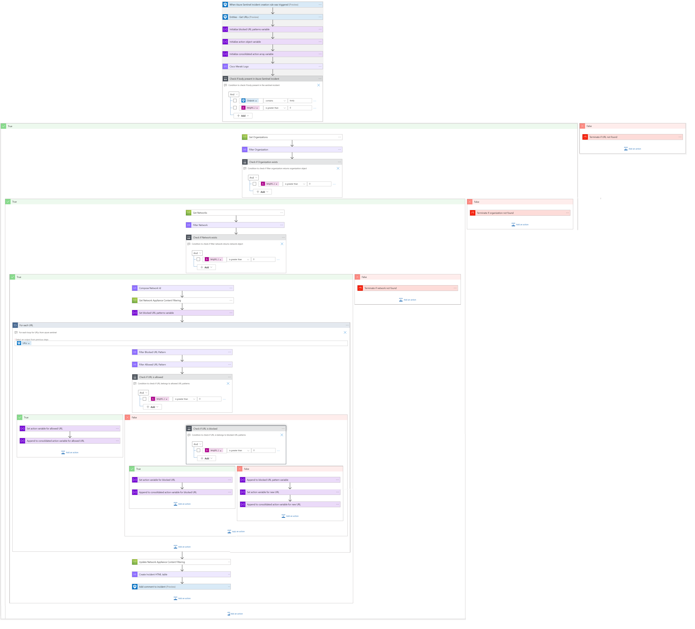
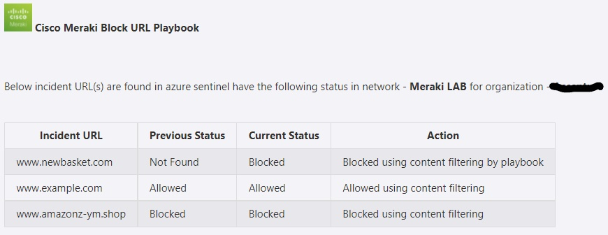

# Cisco Meraki Block URL Playbook

## Summary
 When a new Azure Sentinel incident is created, this playbook gets triggered and performs the below actions:
 1. Fetches a list of potentially malicious URLs.
 2. For each URL in the list, checks if the URL is blocked by the network of the organization.
  - If URL is allowed by the network, then incident comment is created saying URL is allowed.
  - If URL is blocked by the network, then incident comment is created saying URL is blocked.
  - If URL is not blocked by the network and not part of the network, that URL is blocked by playbook.
3. Update the incident with status 'Closed' and reason as
  - For allowed URL - 'BenignPositive - SuspiciousButExpected'
  - For blocked URL - 'TruePositive - SuspiciousActivity'

 ## Pre-requisites for deployment
1. Deploy the Cisco Meraki Custom Connector before the deployment of this playbook under the same subscription and same resource group. Capture the name of the connector during deployment.
2. Cisco Meraki API Key should be known to establish a connection with Cisco Meraki Custom Connector. [Refer here](https://developer.cisco.com/meraki/api-v1/#!getting-started/authorization)
3. Organization name should be known. [Refer here](https://developer.cisco.com/meraki/api-v1/#!getting-started/find-your-organization-id) 
4. Network name should be known.[Refer here](https://developer.cisco.com/meraki/api-v1/#!getting-started/find-your-network-id)

 ## Deployment Instructions
 1. Deploy the playbook by clicking on the "Deploy to Azure" button. This will take you to deploy an ARM Template wizard.

 2. Fill in the required parameters for deploying the playbook.

 | Parameter  | Description |
| ------------- | ------------- |
| **Playbook Name** | Enter the playbook name without spaces |
| **Cisco Meraki Connector name**|Enter the name of Cisco Meraki custom connector without spaces |
| **Organization Name** | Enter organization name |
| **Network Name**| Enter network name | 

# Post-Deployment Instructions 
## a. Authorize API connection
* Once deployment is complete, go under deployment details and authorize Cisco Meraki connection. 
1.  Click the Cisco Meraki connection
2.  Click **Edit API connection**
3.  Enter API Key
4.  Click Save
5. Similarly authorize teams api connection as well.

## b. Configurations in Sentinel
- In Azure sentinel analytical rules should be configured to trigger an incident with URLs. 
- Configure the automation rules to trigger the playbook.

# Playbook steps explained
## When Azure Sentinel incident creation rule is triggered
  Captures potentially malicious or malware URL incident information.

## Entities - Get URLs
  Get the list of URLs as entities from the Incident.

## Check if Organization exists
 *  If organization name exists in list of organizations associated with the account, then return organization. 
 *  If organization name does not exist, then terminate with the error that organization not found.

 ## Check if network exists
  *  If network name exists in list of networks associated with the organization, then return network associated with the organization. 
 *  If network name does not exist, then terminate with the error that network not found.

## For each malicious URL received from the incident
 - Checks if the URL is blocked or allowed by the network of the organization.
   - If URL is allowed by the network then incident comment is created saying URL is allowed using content filtering.
   - If URL is blocked by network then incident comment is created saying URL is blocked using content filtering.
   - If URL is not part of the network, then such URL is blocked by playbook using content filtering. Incident Comment is created saying URL blocked by playbook.
 - Add incident Comment from all the cases.
 - Update the incident with status 'Closed' and reason as
   - For allowed URL - 'BenignPositive - SuspiciousButExpected'
   - For blocked URL - 'TruePositive - SuspiciousActivity'

## Incident comment 

