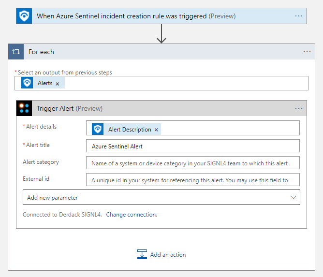

# SIGNL4 Alerting

This playbook will be sending alerts with basic incidents to SIGNL4 teams when an incident is created in Azure Sentinel.

## Pre-requisites:
A [SIGNL4](https://www.signl4.com) account.

[SIGNL4](https://www.signl4.com) is a mobile alerting and incident response service for operational teams. You can send alerts via app push, SMS text or voice calls including tracking, escalation, on-call planning and collaboration.

## Deployment:

## Post-deployment

### Configure connections
Edit the Logic App or go to Logic app designer. 
Expand “Trigger Alert” and connector to your SIGNL4 account by adding a new connection or signing-in to your existing one. 
You also adapt the alert details to be sent according to your needs. You also might want to add conditions or further processing or enrichment before submitting the alert.

### Attach the playbook
After deployment, attach this playbook to an automation rule so it runs when the incident is created.
[Learn more about automation rules](https://docs.microsoft.com/azure/sentinel/automate-incident-handling-with-automation-rules#creating-and-managing-automation-rules) 
Note: Playbook is disabled by default. Please enable it before assigning to the Automation rule!

## Screenshot

