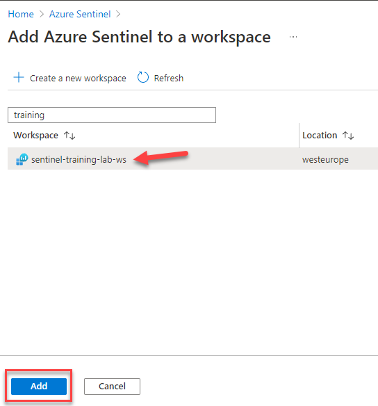
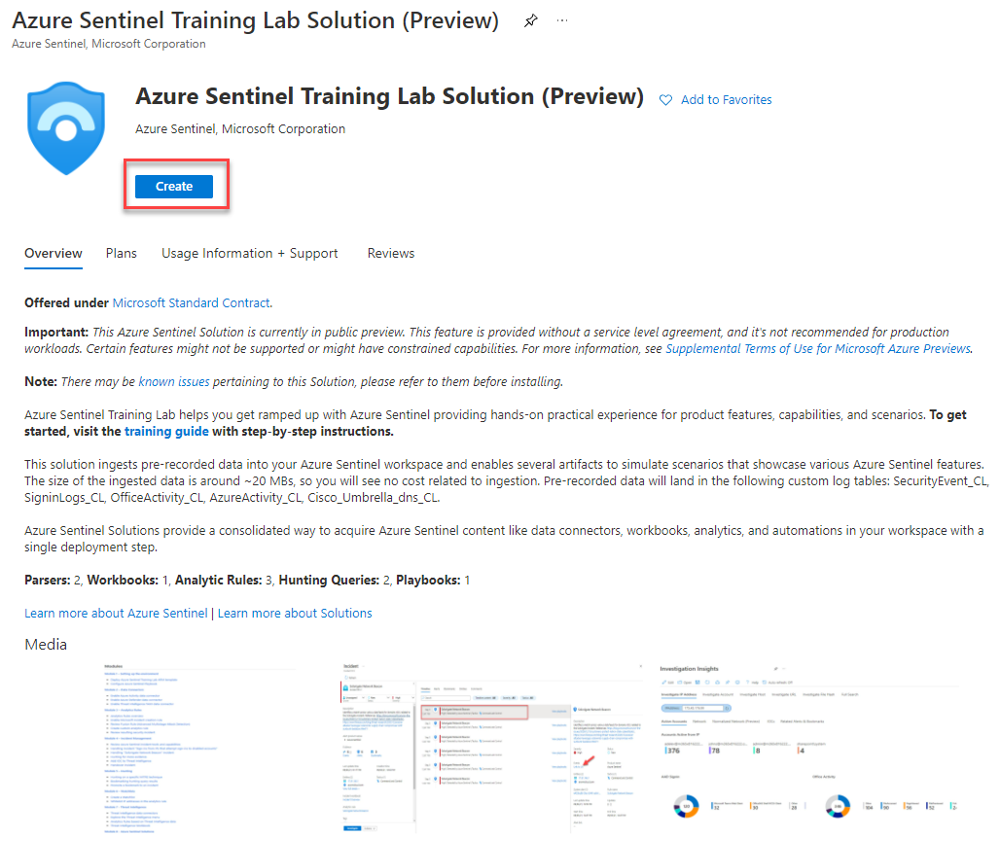
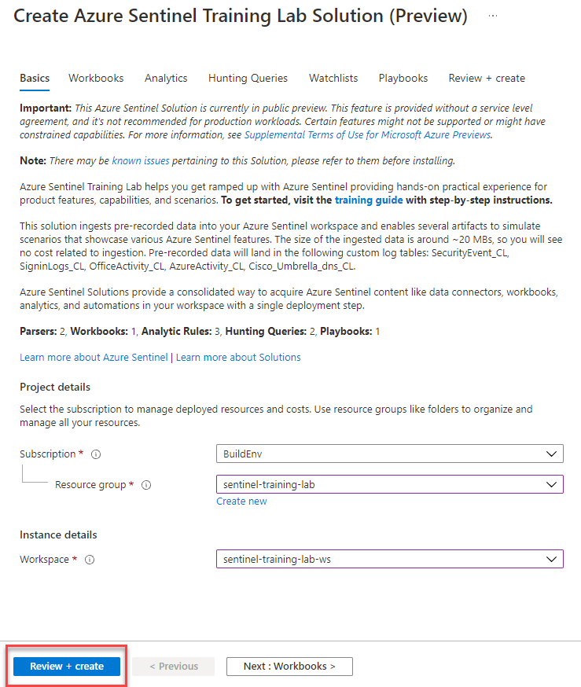
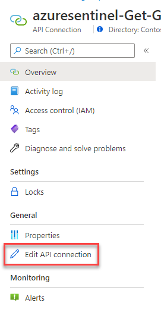

# Module 1 - Setting up the environment

#### 🎓 Level: 100 (Beginner)
#### ⌛ Estimated time to complete this lab: 20 minutes

## Objectives

This module guides you through the deployment of the Microsoft Sentinel Training Lab solution that will be used in all subsequent modules.

#### Prerequisites

To get started with Microsoft Sentinel, you must have a Microsoft Azure subscription. If you do not have a subscription, you can sign up for a free account [here](https://azure.microsoft.com/en/free).

Permissions to create a resource group in your Azure subscription. 

### Exercise 1: The Microsoft Sentinel workspace

In this exercise we will show you how to create a brand new Microsoft Sentinel workspace. If you already have a pre-existing one that you would like to use, you can skip to [Exercise 2](Module-1-Setting-up-the-environment.md#exercise-2-deploy-azure-sentinel-training-lab-arm-template).

1. Navigate to the [Azure Portal](http://portal.azure.com) and log in with your account.

2. In the top search bar, type *Microsoft Sentinel* and click on **Microsoft Sentinel**.

3. In the Microsoft Sentinel screen, click **Create** at the top left.

4. You can choose to add Microsoft Sentinel to an existing Log Analytics workspace or build a new one. We will create a new one, so click on **Create a new workspace**.

5. In the Create Log Analytics workspace page, fill out the form as follows:

    - **Subscription**: choose the Azure subscription where you would like to deploy the Microsoft Sentinel workspace
    - **Resource Group**: select an existing resource group or create a new resource group (recommended) that will host the lab resources
    - **Region**: from the drop down, select the Azure region where the lab will be located
    - **Workspace Name**: provide a name for the Microsoft Sentinel workspace. Please note that the workspace name should include 4-63 letters, digits or '-'. The '-' shouldn't be the first or the last symbol

Click **Review + create** and then **Create** after the validation completes. The creation takes a few seconds.

7.  You will be redirected back to the *Add Microsoft Sentinel to a workspace*. Type the name of your new workspace in the search box, select your workspace and click **Add** at the bottom.

7. Your Microsoft Sentinel workspace is now ready to use!

### Exercise 2: Deploy the Microsoft Sentinel Training Lab Solution

In this exercise you will deploy the Trainig Lab solution into your existing workspace. This will ingest pre-recorded data (~20 MBs) and create several other artifacts that will be used during the exercises.

1. In the Azure Portal, go to the top search bar and type *Microsoft Sentinel Training*. Select the **Microsoft Sentinel Training Lab Solution (Preview)** marketplace item on the right.

2. Read the solution description and click **Create** at the top.

3. In the Basics tab, select the Subscription, Resource Group and Workspace that you created in Exercise 1, or the details for your existing workspace. Optionally, review the different tabs (Workbooks, Analytics, Hunting Queries, Watchlists, Playbooks) in the solution. When ready, click on **Review + create**.

4. Once validation is ok, click on **Create**. The deployment process takes **about 15 minutes**, this is because we want to make sure that all the ingested data is ready for you to use once finished.

5. Once the deployment finishes, you can go back to Microsoft Sentinel and select your workspace. In the home page you should see some ingested data and several recent incidents. Don't worry if you don't see 3 incidents like in the screenshot below, they might take a few minutes to be raised.

### Exercise 3: Configure Microsoft Sentinel Playbook

In this exercise, we will configure a Playbook that will be later used in the lab. This will allow the playbook to access Sentinel.

1. Navigate to the resource group where the lab has been deployed.

2. In the resource group you should see an API Connection resource called **azuresentinel-Get-GeoFromIpAndTagIncident**, click on it.

3. Click on Edi **API connection** under **General**.

4. Click on **Authorize** and a new window will open to chose an account. Pick the user that you want to authenticate with. This should normally be the same user that you're logged in with.

5. Click **Save**.

**Congratulations, you have completed Module 1!**. You can now continue to **[Module 2 - Data Connectors](./Module-2-Data-Connectors.md)**
