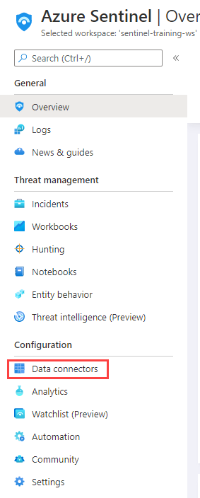
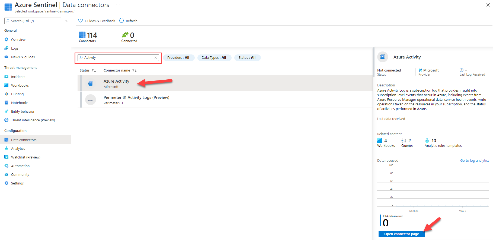
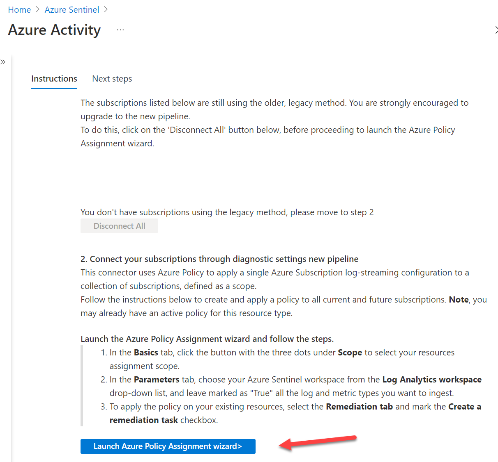
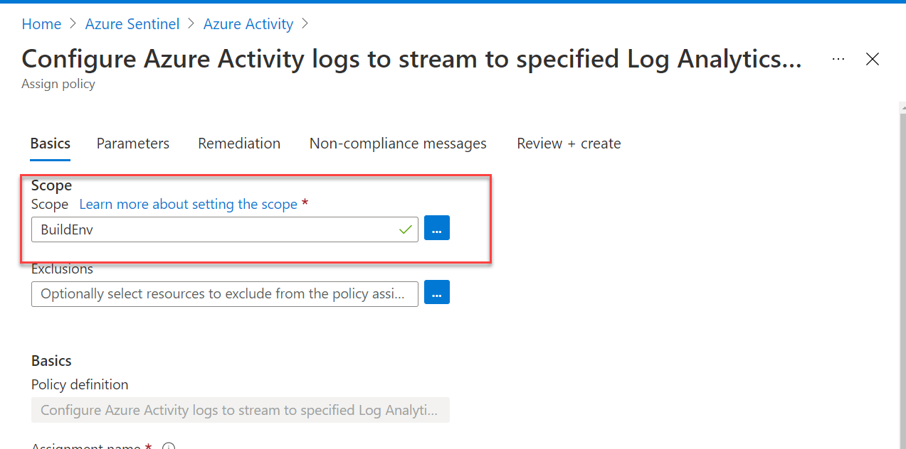
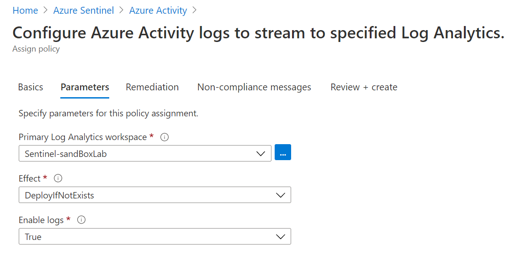
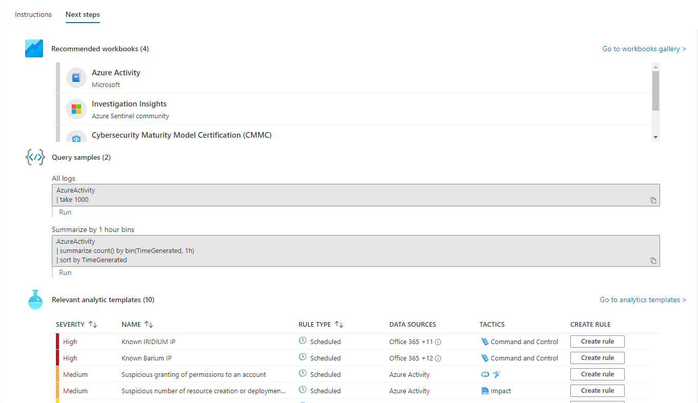
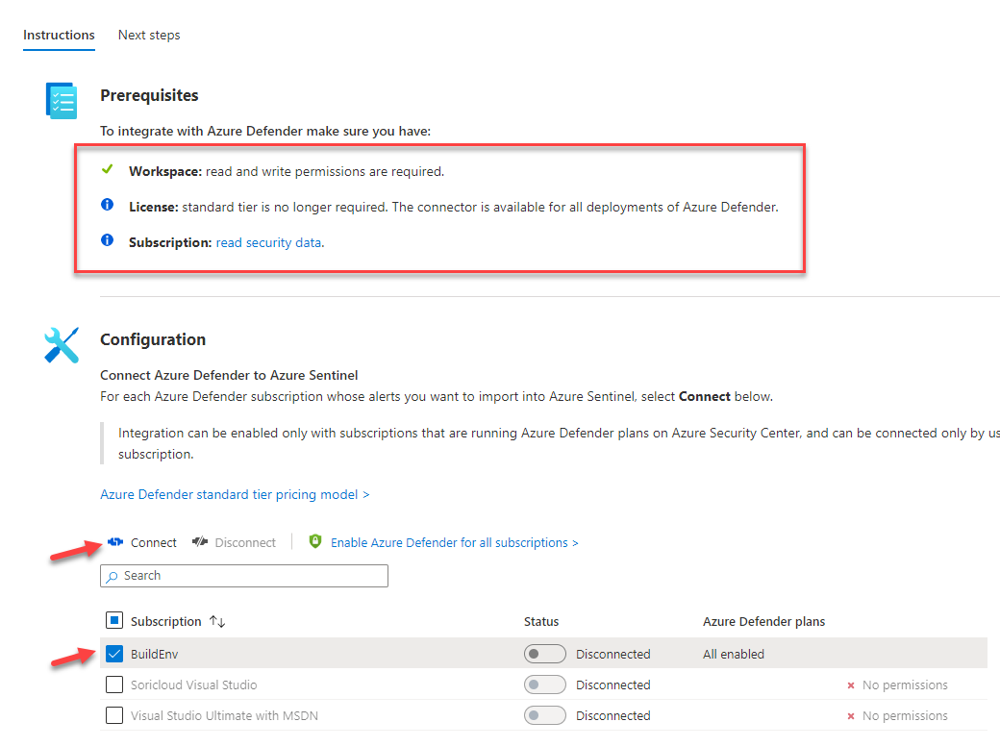
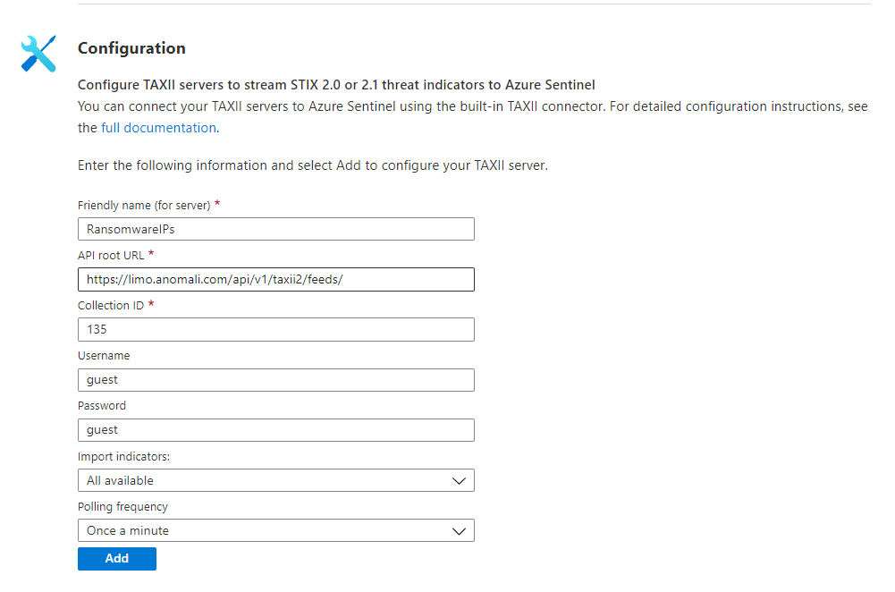

# Module 2 - Data Connectors

#### 🎓 Level: 100 (Beginner)
#### ⌛ Estimated time to complete this lab: 15 minutes

## Objectives

In this module you will learn how to enable Data Connectors in Microsoft Sentinel to bring alerts and/or telemtry from different sources.

#### Prerequisites

This module assumes that you have completed [Module 1](Module-1-Setting-up-the-environment.md), as you will need an Microsoft Sentinel workspace provisioned.

Some of the data connectors that will be used in this lab, require some specific permissions on the workspace or your azure subscription. If you don't have the appropriate permissions, you can still continue doing the rest of the labs.

### Exercise 1: Enable Azure Activity data connector

This exercise shows you how to enable the Azure Activity data connector. This connector will bring into your Microsoft Sentinel workspace all the audit events for actions performed in your Azure subscription.

**NOTE**: To do this exercise, your user must have Reader permissions to any subscription which logs you want to stream into Microsoft Sentinel. 

1. Go to you Microsoft Sentinel workspace and select **Data Connectors** under **Configuration** section.

2. In the data connectors screen, type **actvity** in the search bar, select the **Azure Activity** connector and click on **Open connector page**.

3. In the Azure Activity connector page, go to option number 2 **Connect your subscriptions through diagnostic settings new pipeline**. This method leverages Azure Policy and it brings many improvements compared to the old method (more details about these improvements can be found [here](https://techcommunity.microsoft.com/t5/azure-sentinel/moving-azure-activity-connector-to-an-improved-method/ba-p/2479552)).

4. Click on the **Launch Azure Policy Assignment wizard**, this will redirect you to the policy creation page.

On the Scope selection select your relevant subscription.

**NOTE**: Please note that if you have owner permission on a management group level, you can assign this policy to configure collection of Azure Activity logs form all the subscriptions under the management group.

5. Go to the **Parameters** tab. On the **Primary Log Analytics workspace** select the Microsoft Sentinel workspace:

6. Press **Review and Create** to save this policy and **Create**.

7. Click on **Next Steps**. Here you see what content is available for the telemetry that is brought into Sentinel by this connector, like Workbooks, Query samples and Analytics Rules.

8. It is normal if you don't immediately see the connector showing as connected and in green. Also, each subscription has a maximum of 5 destinations for its activity logs. If this limit is already reached, the policy created as part of this exercise won't be able to add an additional destination to your Microsoft Sentinel workspace.

### Exercise 2: Enable Azure Defender data connector

This exercise shows you how to enable the Azure Defender data connector. This connector allows you to stream your security alerts from Azure Defender into Microsoft Sentinel, so you can view Defender data in workbooks, query it to produce alerts, and investigate and respond to incidents.

**NOTE**: To do this exercise, your user must have the Security Reader role in the subscription of the logs you stream. If not done already, you will need to enable Azure Defender within Azure Security Center.

1. Go to you Microsoft Sentinel workspace and select **Data Connectors** under *Configuration* section.

2. In the data connectors screen, type *defender* in the search bar, select the *Azure Defender* connector and click on *Open connector page*.

3. In the Azure Defender connector page, check that your permissions are enough at the top. If you don't have the required permissions, you can continue to the next exercise.

4. From the list of subscriptions at the bottom of the page, select the desired subscription an click on *Connect*. Wait for the operation to complete.

5. Click on *Next Steps* at the top of the page and explore what content is available for this connector.

### Exercise 3: Enable Threat Intelligence TAXII data connector

This exercise shows you how to enable the Threat Intelligence - TAXII data connector. This connector allows you to send threat indicators from TAXII servers to Microsoft Sentinel. Threat indicators can include IP addresses, domains, URLs, and file hashes.

**NOTE**: To do this exercise, your user must have the Security Reader role in the subscription of the logs you stream. If not done already, you will need to enable Azure Defender within Azure Security Center.

1. Go to you Microsoft Sentinel workspace and select *Data Connectors* under *Configuration* section.

2. In the data connectors screen, type *taxii* in the search bar, select the *Threat intelligence - TAXII* connector and click on *Open connector page*.

3. In the Threat Intelligence - TAXII connector page, add the following information under *Configuration* menu:

    - **Friendly name (for server)**: RansomwareIPs
    - **API root URL**: https://limo.anomali.com/api/v1/taxii2/feeds/
    - **Collection ID**: 135
    - **Username**: guest
    - **Password**: guest
    - **Import Indicators**: All available (review all available options)
    - **Polling frequency**: Once an minute (review all available options)

4. Click *Add* and wait until the operation completes.

5. Click on *Next Steps* at the top of the page and explore what content is available for this connector. In a few seconds, the ThreatIntelligenceIndicator will be populated with IOCs from Anomali's feed.

**Congratulations, you have completed Module 2!**. You can now continue to **[Module 3 - Analytics Rules](./Module-3-Analytics-Rules.md)**
